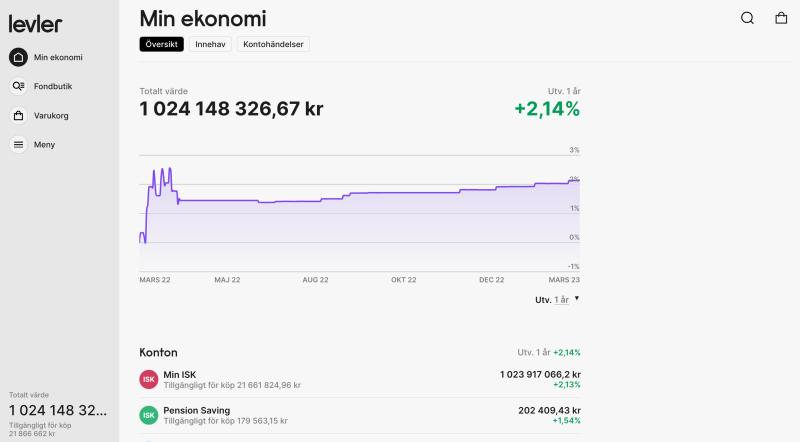
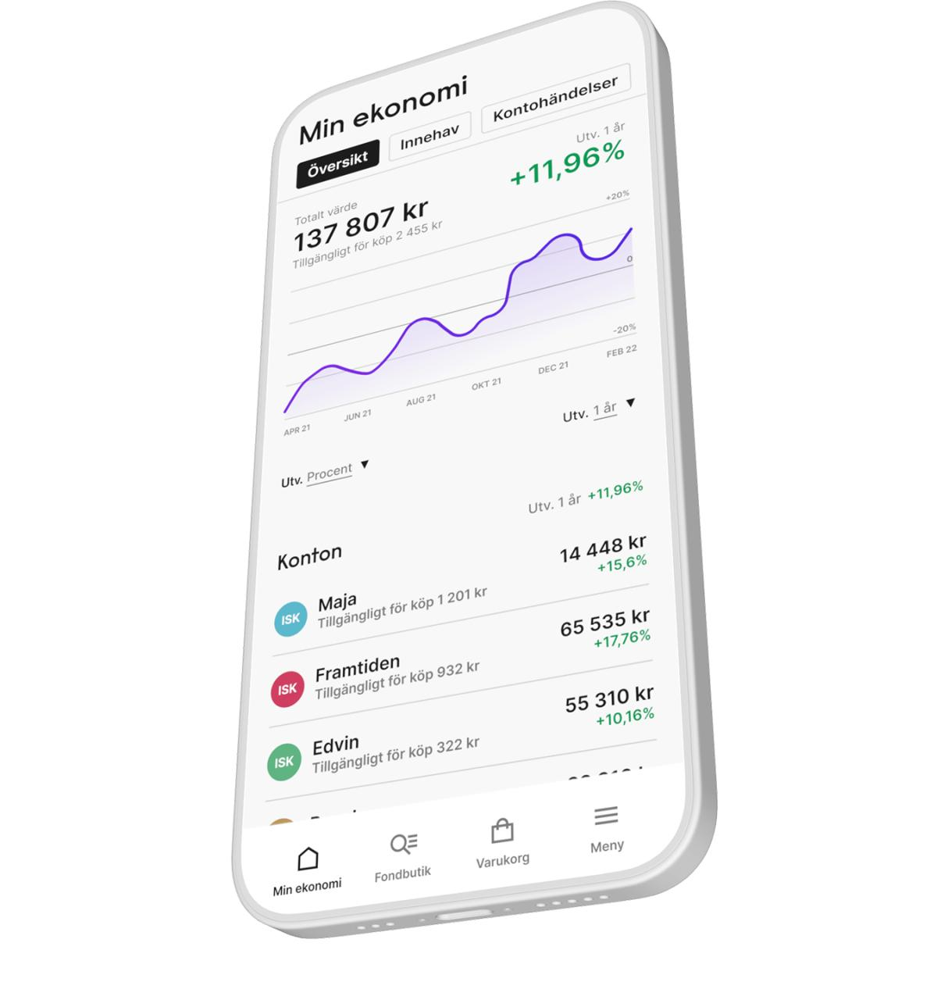
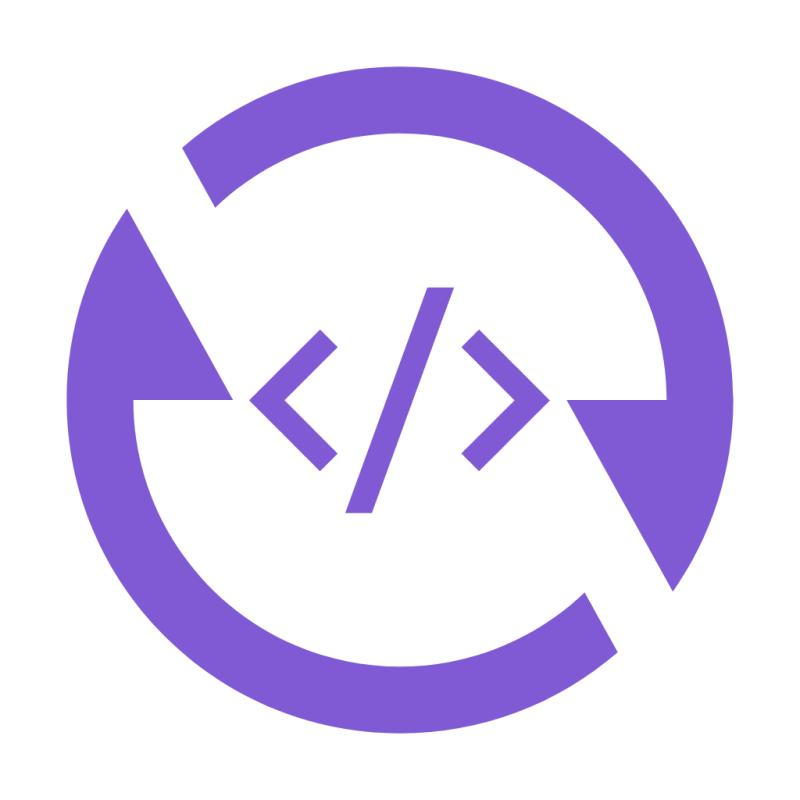
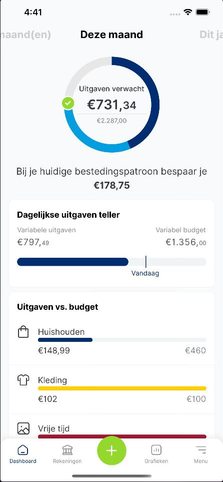
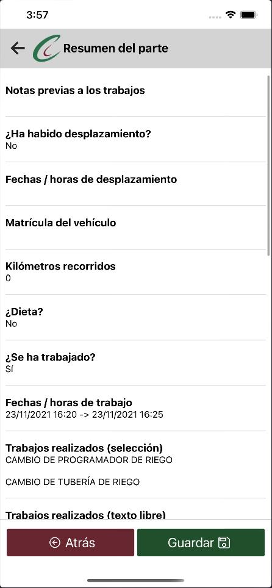
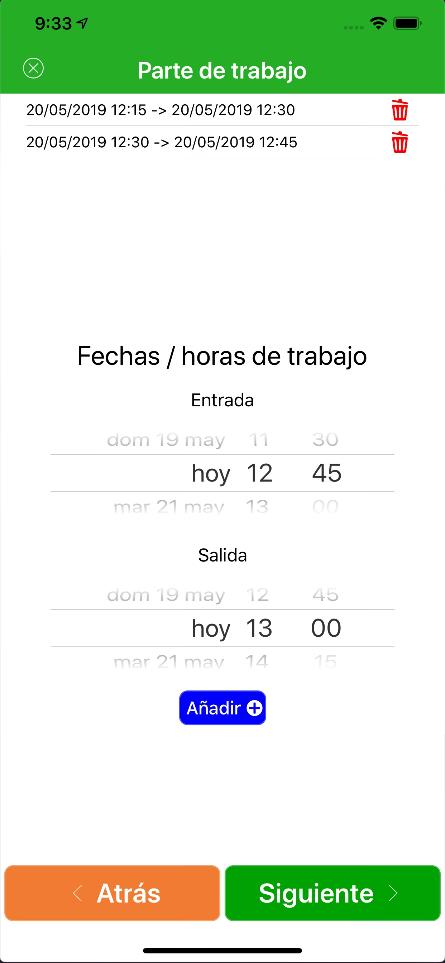
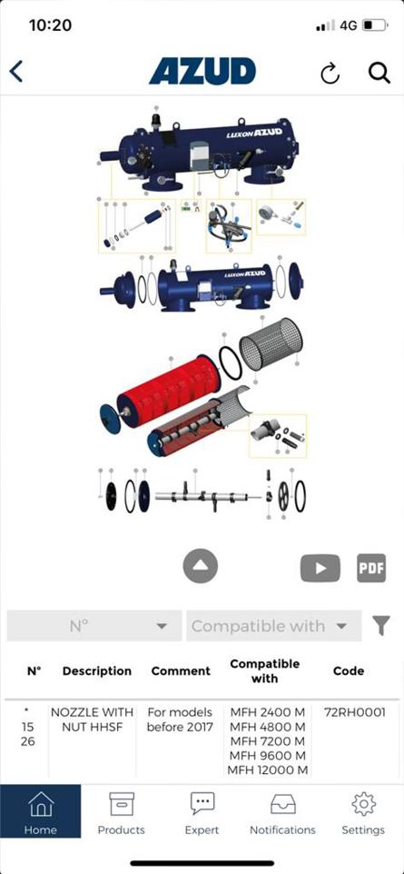
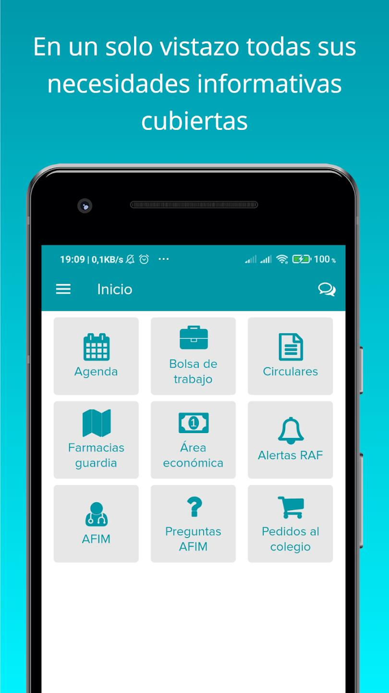

Juan Manuel Molina López  
**Software Engineer & Full Stack Developer**  
juanm4@gmail.com    

1. [ Overview ](#overview)
2. [ Experience ](#experience)
3. [ Education ](#education)
4. [ Key achievements ](#key_achievements)
5. [ Skills ](#skills)
6. [ Portfolio ](#portfolio)

 

# Overview 📝

I started my professional career as backend engineer. Creating enterprise scale backends, using Java, .NET, PHP, Node.JS, MySQL...
Later I discovered a new pasion for develop mobile apps with android, iOS and React Native. 
Lately I have been also focused on building front-end projects using React, NextJS and AngularJS.
I love writting clean code and build good architectures.
To sum up how I see myself, I would say this:

**I am not always brilliant. But when I am, it is awesome.**

 

# Experience 💼

#### Software engineer & Full-stack Developer
##### [Charles River Laboratories](https://www.criver.com/) (june 2023 - Present)

- Transforming design and product vision into working products.
- Directly influencing user interaction with the system by developing across
the complete application architecture from the user interface to the back-
end ecosystem of services and application.
- Staying on top of fast changing technology and constantly learning new
tricks.
- Early adopter of industry trends in client and server-side.
- Developing scalable software platforms and applications, as well as efficient
networking solutions.
- Using React for frontend and Fastify for backend.
- Orchestrating shared packages, libraries and services across the whole company under Lerna and NX monorepo.
- Testing everything using unit tests (jest/vitest) and e2e tests (playwright).
- Conducting code reviews with team members.
- Ensuring continuous integration/delivery using Azure DevOps & Github
Actions.
- Maintaining a love for clean code and a passion for user-centered, high
quality, performant engineering.

# 
#### Senior Full Stack Developer & Scrum master
##### [DIGIO Soluciones Digitales](https://digio.es/es) (march 2020 - june 2023)

- Developing all kind of solutions using the latest technologies.
- Led a small, agile team in the development of projects, like a trading
platform designed for shopping shares and funds (Levler.se) or a platform to
handle your monthly savings (MijnGeldzaken Huishoudboekje).
- Managed client relationships by conducting periodic meetings to gather
project requirements, provide status updates, and ensure alignment with
business objectives.
- Architected and oversaw the development of the platform's frontend and
backend using React, iOS and React Native for the frontend and NestJS for
the backend.
- Applied best practices in software development, including code reviews, unit
testing, and CI/CD pipelines, to maintain code quality and efficiency.
- Led the technical planning, breaking down complex features into actionable
tasks and ensuring smooth execution through effective sprint management.
- Mentored junior developers and provided guidance on best practices, design
patterns, and problem-solving techniques.
- Contributed to improving team productivity through the adoption of modern
development tools and techniques.

# 
#### Team leader & Senior Full Stack Developer (Android, iOS, Web)
##### [GRUPO ISOTADER](https://www.isotader.com/) (may 2014 - march 2020)

- Software engineer & Senior Developer iOS, Android & Web.
- Symfony & Laravel framework
- Node.js (Javascript, Types, JSX)
- React Native / Redux
- Android (Java & Kotlin)
- iOS (Swift)
- Build an streaming server using NGINX-RTMP

# 
#### Design & Developer
##### [Droiders](https://www.droiders.com/) (july 2012 - january 2023)

- Social media project with Symfony, PHP5, HTML5 & JS.
- Template design Twig, CSS3, BOOTSTRAP.
- Integration with Facebook, Twitter and Paypal.
- Geolocation with GoogleMaps and OpenStreetMaps.

 

# Education 🎓

- **Master of Mobile Business**
  - [University of Murcia](https://www.um.es/) (january 2013 - december 2014)
 

- **Computer engineering degree**
  - [University of Murcia](https://www.um.es/) (january 2006 - december 2011)
 
 

 # Key achievements 🌟

- **Deployment Efficiency**
  - Reduced deployment time by 30% using Azure DevOps and Github CI/CD pipelines.
 

- **Solving problems**
  - Developed a esbuild plugin to be able to use alias paths on built projects with typescript
 

- **Performance Optimization**
  - Increased frontend performance by 20% through code optimization and refactoring.
 

- **Testing Proficiency**
  - Implemented 50+ unit and E2E tests, improving software reliability by 60%.

 

# Skills 🛠️

**Javascript & Typescript**

- 
React.js

- 
Fastify

- 
Node.js

- 
Next.js

- 
TypeScript

- 
React Native

- 
NX Monorepo

 

**PHP**

- 
PHP

- 
Laravel

- 
Symfony

 

**Mobile**

- 
Java

- 
SwiftUI

- 
Kotlin

- 
iOS Development

- 
Android Development

 

**Python**

- 
Django

 

**Database**

- 
Gremlin Query Language (TinkerPop - Graph DB)

- 
MongoDB

- 
MySQL

- 
PostgreSQL

 

**Others**

- 
Docker

- 
Azure DevOps

- 
GoF Patterns

- 
Agile Methodologies

- 
Github Actions

- 
S.O.L.I.D. Principles

- 
Streaming server NGINX-RTMP

 

**Testing**

- 
Jest

- 
Cypress

- 
Playwright

 

 

# Portfolio 📁

#### Levler React App

Levler is an application to buy funds and online products. You can collect your shopping cart and checkout.
Developed using React, hooks, typescript and following good practices as TDD and clean code. It's fully tested and building reusable and isolated components from Figma designs. Also, we have used react-query to make the requests much more powerful.

More info: https://levler.se/

#### Levler iOS App

Levler is an application to buy funds and online products. You can collect your shopping cart and checkout.
This app has been developed using swiftUI, with support for light and dark mode. Also, we have following good practices and clean architectures (VIPER).

iOS: https://apps.apple.com/se/app/apple-store/id1617260606
More info: https://levler.se/appen/

#### GitHub Tutorial - How to implement Hexagonal architecture in frontend (Javascript/Typescript)

A post in which I explain how to implement hexagonal architecture on the frontend. It contains examples of how to use the same services regardless of the framework you use.
In the examples you can see how you can exchange between react, vue and react native with almost no effort.

More info: https://github.com/juanm4/hexagonal-architecture-frontend

#### DevConverter NextJS Web

DevConverter is an online file converter and much more. It supports nearly all audio, video, document, ebook, archive, image, spreadsheet, and presentation formats.

Developed using next.js (with typescript) framework using hexagonal architecture. Completely tested with jest.
On frontend it uses tailwind templates and react.
On backend side it uses node.js and nginx as reverse proxy.
Moreover, it declares an API documentation based on swagger standar and handles payments with Stripe.

More info: https://devconverter.com/

#### GetOutPdf Laravel Web

A Laravel project that implements both frontend and backend. It uses twig as html templates and php for the backend. Also, it implements payments with Stripe.

On the server side, nginx handles all the stuff.

More info: https://getoutpdf.com/

#### MijnGeldzaken React Native App

This is a fintech app to get control over your personal finance. It uses typescript and react native. The app implements oAuth2 as login, save encrypted data, upload images and PSD2 bank connections.

iOS: https://apps.apple.com/es/app/mijngeldzaken-huishoudboekje/id1512109662
Android: https://play.google.com/store/apps/details?id=nl.mijngeldzaken.app

#### Cascales React Native App

With this application companies are able to complete the tasks and work carried out by their technicians digitally and online.

It has been develop in React Native and support images, dates, signatures...

iOS: https://apps.apple.com/es/app/cascales/id1597310392

#### CEM iOS App

This app organises and completes your company's work reports. It displays step-by-step form with support for dates, images and manual signatures.

The app has been developed using iOS native and swift.

iOS: https://apps.apple.com/es/app/cem-automatismos/id1454785108

#### Azud React Native App

AZUD Spares is an app that offers to clients an intuitive tool for the correct selection of spare parts for all your filtration products.

It's has been developed using React Native and typescript. One of the best parts of this application is that it can build different layers above an image with clickable and detectable points.

iOS: https://apps.apple.com/es/app/azud-repuestos/id1518839997
Android: https://play.google.com/store/apps/details?id=com.azud.spares

#### College of Pharmacists Native App

This is an application for the College of Pharmacists of Murcia. This application has been developed for iOS and Android platforms using native language, swift and java respectively.

The views are adapted to work with all kind of screens, such tablet and mobile.

iOS: https://apps.apple.com/es/app/cofrm/id1453860144
Android: https://play.google.com/store/apps/details?id=com.isotader.cofrm
